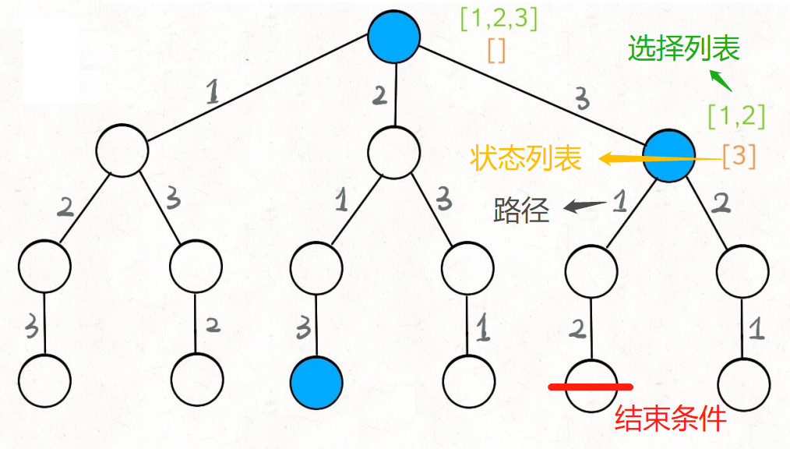

# List

#### 双指针

+ **快慢指针**

  if else if : 快指针 **持续** 往前走，慢指针 **满足条件时** 往前走

+ **首尾夹击**

  left++; right--;

+ **二分查找**

  ```java
  //  ∵ int right = nums.length - 1; 
  //  ∴ 搜索范围是 [left, right]，从而 [left + 1, left] 为空
  //  ∴ while (left <= right)  
  int binarySearch(int[] nums, int target) {
  	int left = 0;
  	int right = nums.length - 1; // 固定
   	while (left <= right) { 
      	int mid = left + (right - left) / 2;  // 固定
      	if (nums[mid] == target)   // three condition
          	return mid;       // in
      	else if (nums[mid] < target)
          	left = mid + 1; // in
      	else if (nums[mid] > target)
         		right = mid - 1; // in
  	} 
      return -1;
  }
  ```


#### 遍历并收集信息

减少遍历的次数


#### 最优子结构问题

>  核心思想是：穷举 🍛

>  大范围 包含 小范围
>
>  子问题必须相互独立

> 四步：定义的**『状态』**参数🥠 ，可以做哪些『**选择**』🌮，明确『**DP**』含义 🥙，最后『**穷举**』🥩出所有情况

1. 自下向上 = 动态规划

   ```
   for 状态1 in 状态1的所有取值：
       for 状态2 in 状态2的所有取值：
           for ...
               dp[状态1][状态2][...] = 择优(选择1，选择2...)
   ```

2. 自顶向下 = 递归穷举 + 备忘录

   ``` java
   HashMap map = new HashMap();
   int traverse(TreeNode root) {
       if (map.containsKey(key)) return map.get(key);
       for (TreeNode child : root.children) {  // N叉树深搜
           traverse(child);
           // do here 中序遍历
       }
       // do here 后序遍历
       map.put(key, value);
      	return map.get(key);
   }
   ```

   

#### 决策遍历（回溯）

>全程说的是当前节点
>
>选择列表： 可以做的选择，路径分支  
>
>路径分支： 做选择
>
>状态列表： 已做选择的合集  
>
>结束条件： 到达决策树底层， ⽆法再做选择的条件  

``` java
result = []
def backtrack(路径, 选择列表):
    if 满⾜结束条件:
        result.add(路径)
        return
    for 选择 in 选择列表: // fori 🥗选择列表 
        做选择，在当前节点，更新状态列表  
        backtrack(路径, 选择列表) 
        撤销选择，在当前节点，更新状态列表  
```




#### 位操作

左移：1 << n    2^n       反之：右移

数字 第n位上 数值： ( num >> n ) & 1